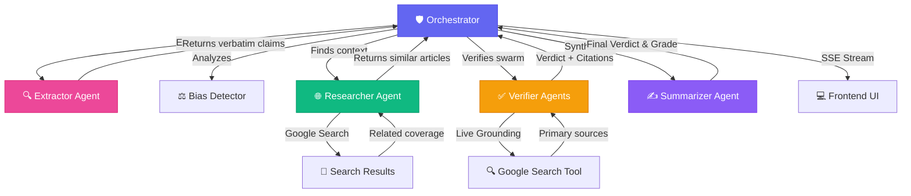

# 🎯 FactLens - Real-Time AI Fact-Checking & Trust Analysis

> **Google AI Agents Hackathon 2026**

An advanced, multi-agent AI framework that transforms how we consume information by providing real-time, grounded fact-checking and automated bias analysis directly in your browser.

## ✨ Key Value Propositions

- **🏦 Knowledge Vault**: Ground AI analysis in your own private data (PDF, TXT, etc.) with instant GCS fallback retrieval.
- **🚀 Multi-Agent Swarm**: Parallel execution of Extraction, Verification, Bias Detection, and Research.
- **🛡️ Production-Grade Safety**: Integrated with **Google Model Armor** for PII filtering and prompt injection protection.
- **🎙️ Narrator Mode**: Word-level synchronized text-to-speech highlighting directly on the webpage.
- **⚙️ Multi-Model Support**: Support for Gemini 2.0 Flash/Pro and VLLM backends.

## Demo

*(Video demo coming soon)*

### Presentation

[View Project Presentation](https://docs.google.com/presentation/d/your-link-here/)

---

## 🔍 The Experience

Imagine you're reading a complex political article or a sensational news piece.

A question flickers in your mind: *"Wait, is that actually true?"*

Instead of openning ten tabs to verify, you simply click **Analyse Page Content** in your **FactLens** sidepanel.

The system springs into action with a coordinated team of AI agents:

1. **The Extractor** scans the page, surgically identifying atomic, verifiable claims.
2. **The Bias Detector** senses the emotional framing and hidden interests in the writing.
3. **The Researcher** consults Google Search in the background, finding similar coverage to provide context.
4. **The Verifiers** (a swarm of specialized agents) go into deep-dive mode, cross-referencing every claim against **Live Google Search Grounding**.

As the analysis unfolds, the page comes alive:

- **Accuracy Gauge**: A real-time trust meter visualizes the overall credibility of the content.
- **Smart Highlighting**: Factual claims are highlighted directly in the article.
- **Click-to-Verify**: Hover over any highlighted text to see the AI's reasoning and citations instantly.

**FactLens transforms reading from a passive activity into a verified dialogue.**

## 🚀 Production Deployment

We provide a comprehensive infrastructure-as-code template for production rollout.

### 🏛️ Infrastructure (Terraform)
Located in `/terraform`, this setup automates:
- **Cloud Run**: Multi-instance CPU-optimized backend.
- **Cloud Storage**: Secure bucket for the Knowledge Vault.
- **IAM**: Least-privilege roles for Discovery Engine and GCS.

**Usage:**
```bash
cd terraform
terraform init
terraform apply -var="project_id=YOUR_PROJECT" -var="gcs_bucket_name=YOUR_BUCKET" -var="data_store_id=YOUR_DATA_STORE"
```

### 🔄 CI/CD (GitHub Actions)
The `.github/workflows/deploy.yml` automates:
1. **Containerization**: Builds a production-ready Docker image.
2. **Artifact Registry**: Pushes the image to Google's registry.
3. **Cloud Run Rollout**: Updates the service with zero downtime.

### 🧪 CPU-Only VLLM (Optional)
To run VLLM on CPU (no GPUs) in production:
1. Set `count = 1` in `terraform/cpu_inference.tf`.
2. Update the backend environment variable `VLLM_SERVICE_URL` to point to the new service.

---

## 🏗️ Architecture Detail
Detailed information about the Multi-Agent orchestrator and Knowledge Vault can be found in our [Architecture Guide](architecture.md).

---

## 🧩 The Architecture

Built using a **multi-agent orchestration** pattern powered by **Gemini 2.5 Flash** and deployed on **Google Cloud Run**.



### 📁 Project Structure & File Index

| Directory / File | Purpose |
|------------------|---------|
| **`extension/`** | **Chrome Extension Frontend** |
| ├─ `manifest.json` | Web extension configuration and permissions. |
| ├─ `sidepanel.html/js` | Main UI for chat, analysis, and grounding results. |
| ├─ `dashboard.html/js` | **Knowledge Vault** management interface (Upload/List/Delete). |
| ├─ `content_script.js` | Handles page text extraction and DOM highlights. |
| ├─ `background.js` | Service worker managing extension state. |
| ├─ `styles/` | CSS design system for a premium dark-mode experience. |
| **`backend/`** | **FastAPI Multi-Agent Backend** |
| ├─ `main.py` | API entry point, SSE streaming logic, and Vault endpoints. |
| ├─ `agents/` | AI Agent Logic: `extractor`, `verifier`, `bias_detector`, `summarizer`, `researcher`. |
| ├─ `services/` | Infrastructure: `orchestrator`, `inference` (Gemini), `vault` (GCS/Vertex), `model_armor`. |
| ├─ `.env` | Environment configuration (Project ID, Buckets, Data Stores). |
| **`root/`** | **Utilities & Documentation** |
| ├─ `migrate_vault.py` | Utility to migrate local files to the Cloud Vault. |
| ├─ `secret_test.txt` | Grounding test data for "Paul a Coder" verification. |
| ├─ `README.md` | Comprehensive project documentation. |

---

## 🏦 Knowledge Vault Architecture

The **Knowledge Vault** allows users to ground AI analysis in their own private documents (PDF, TXT, etc.).

1.  **Storage**: Files are uploaded to **Google Cloud Storage (GCS)** for persistent, secure storage.
2.  **Indexing**: **Vertex AI Search (Discovery Engine)** indexes these documents for semantic retrieval.
3.  **Grounding**: During analysis, the **Orchestrator** performs a semantic search across the vault.
4.  **Fallback Retrieval**: If a document is newly uploaded, the system uses a **GCS Direct-Content Fallback** to ensure the AI can access the information immediately, even before full indexing is complete.
5.  **Visual Indicators**: Claims grounded in the vault are marked with a 🏦 icon in the UI.

---

## 🎭 Agent Roles

| Agent | Role | Capabilities |
|-------|------|--------------|
| 🛡️ **Orchestrator** | The conductor | Manages state, handles concurrency, and streams results via SSE |
| 🔍 **Extractor** | The sharp-eyed reader | Identifies distinct, verifiable claims as exact quotes |
| ✅ **Verifier** | The truth-seeker | Uses **Vertex AI Grounding** to cross-reference claims in real-time |
| 🌐 **Researcher** | The librarian | Finds similar articles and provides broader context via search |
| ⚖️ **Bias Detector** | The analyst | Detects political leaning, corporate interests, and emotional framing |
| ✍️ **Summarizer** | The judge | Synthesizes all findings into a concise, authoritative Trust Assessment |

---

## ⚙️ Technologies Used

| Technology | Purpose |
|------------|---------|
| **Gemini 2.5 Flash** | Core reasoning, extraction, and summarization |
| **Vertex AI Grounding** | Real-time connection to Google Search results |
| **Model Armor** | Production-grade safety, PII filtering, and anti-injection |
| **FastAPI** | High-performance asynchronous backend with SSE |
| **Chrome Extension API** | Deep browser integration, DOM manipulation, and side panels |
| **Cloud Run** | Scalable, serverless hosting for the multi-agent backend |

---

## 🚀 Setup Instructions

### Prerequisites

- Python 3.9+
- Google Cloud Project with Vertex AI and Model Armor enabled
- Chrome/Edge Browser

### Installation

1. **Clone the repository**

```bash
git clone https://github.com/DevPaulVarghese/FactLens.git
cd FactLens
```

1. **Backend Setup**

```bash
cd backend
python -m venv venv
source venv/bin/activate  # Windows: venv\Scripts\activate
pip install -r requirements.txt
cp .env.template .env     # Fill in your PROJECT_ID and key path
python main.py
```

1. **Extension Setup**

- Open `chrome://extensions/`
- Enable **Developer Mode**
- Click **Load unpacked**
- Select the `extension` folder from this repo

---

## 🎨 Why It's Cool

✨ **Live Truth Tracking**  

- Not just static analysis, but dynamic verification against the live web.

🧪 **Multi-Agent Swarm**  

- Agents work in parallel to provide Bias, Similar Coverage, and Fact-Checking simultaneously.

🛡️ **Model Armor Protection**  

- The only fact-checker that uses dedicated safety layers to protect against malicious injections.

🎭 **Premium User Experience**  

- Sleek dark-mode UI, real-time trust meters, and intelligent page highlighting.

---

## 🧭 Future Roadmap

- 🎤 **Voice Discovery**: "FactLens, can you verify that last paragraph?"
- 📊 **Historical Tracking**: See how sources improve or degrade in trust over time.
- 👯 **Collaborative Verification**: Community-driven grounding signals.
- 📱 **Mobile Integration**: Bring FactLens to mobile browsers and social apps.

---

## 📝 License

Part of the Google AI Agents Hackathon 2026.

---

> "Information is everywhere. **Truth** shouldn't be hard to find.  
> FactLens brings the power of AI Agents to your browser,  
> turning every page into a verified experience."
