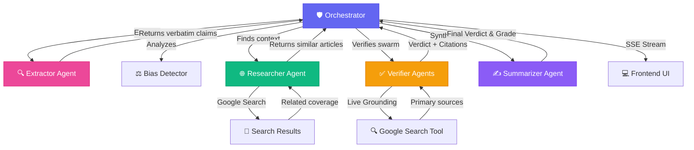

# 🎯 FactLens - Real-Time AI Fact-Checking & Trust Analysis

> **Google AI Hackathon — Productive and Informative Category**

An advanced, multi-agent AI framework that transforms how we consume information by providing real-time, grounded fact-checking and automated bias analysis directly in your browser.

## Demo
*(Video demo coming soon)*

### Presentation
[View Project Presentation](https://docs.google.com/presentation/d/your-link-here/)

---

## 🔍 The Experience

Imagine you're reading a complex political article or a sensational news piece.

A question flickers in your mind: *"Wait, is that actually true?"*

Instead of openning ten tabs to verify, you simply click **Analyse Page Content** in your **FactLens** sidepanel.

The system springs into action with a coordinated team of AI agents:

1.  **The Extractor** scans the page, surgically identifying atomic, verifiable claims.
2.  **The Bias Detector** senses the emotional framing and hidden interests in the writing.
3.  **The Researcher** consults Google Search in the background, finding similar coverage to provide context.
4.  **The Verifiers** (a swarm of specialized agents) go into deep-dive mode, cross-referencing every claim against **Live Google Search Grounding**.

As the analysis unfolds, the page comes alive:
- **Accuracy Gauge**: A real-time trust meter visualizes the overall credibility of the content.
- **Smart Highlighting**: Factual claims are highlighted directly in the article.
- **Click-to-Verify**: Hover over any highlighted text to see the AI's reasoning and citations instantly.

**FactLens transforms reading from a passive activity into a verified dialogue.**

---

## 🧩 The Architecture

Built using a **multi-agent orchestration** pattern powered by **Gemini 2.5 Flash** and deployed on **Google Cloud Run**.



### 📁 Project Structure

```
factlens/
├── extension/          ← Chrome Extension (UI & Logic)
│   ├── manifest.json   # Extension manifest
│   ├── sidepanel.js    # Core UI interaction
│   └── content_script.js # DOM Highlighting & TTS
│
├── backend/            ← FastAPI Service (Agents & Tools)
│   ├── agents/         # AI Agent implementations
│   ├── services/       # Orchestration & Infrastructure
│   └── main.py         # API Endpoints
│
└── extension_deployment/ ← Production Artifacts (.zip, .crx)
```

---

## 🎭 Agent Roles

| Agent | Role | Capabilities |
|-------|------|--------------|
| 🛡️ **Orchestrator** | The conductor | Manages state, handles concurrency, and streams results via SSE |
| 🔍 **Extractor** | The sharp-eyed reader | Identifies distinct, verifiable claims as exact quotes |
| ✅ **Verifier** | The truth-seeker | Uses **Vertex AI Grounding** to cross-reference claims in real-time |
| 🌐 **Researcher** | The librarian | Finds similar articles and provides broader context via search |
| ⚖️ **Bias Detector** | The analyst | Detects political leaning, corporate interests, and emotional framing |
| ✍️ **Summarizer** | The judge | Synthesizes all findings into a concise, authoritative Trust Assessment |

---

## ⚙️ Technologies Used

| Technology | Purpose |
|------------|---------|
| **Gemini 2.5 Flash** | Core reasoning, extraction, and summarization |
| **Vertex AI Grounding** | Real-time connection to Google Search results |
| **Model Armor** | Production-grade safety, PII filtering, and anti-injection |
| **FastAPI** | High-performance asynchronous backend with SSE |
| **Chrome Extension API** | Deep browser integration, DOM manipulation, and side panels |
| **Cloud Run** | Scalable, serverless hosting for the multi-agent backend |

---

## 🚀 Setup Instructions

### Prerequisites

- Python 3.9+
- Google Cloud Project with Vertex AI and Model Armor enabled
- Chrome/Edge Browser

### Installation

1. **Clone the repository**
```bash
git clone https://github.com/DevPaulVarghese/FactLens.git
cd FactLens
```

2. **Backend Setup**
```bash
cd backend
python -m venv venv
source venv/bin/activate  # Windows: venv\Scripts\activate
pip install -r requirements.txt
cp .env.template .env     # Fill in your PROJECT_ID and key path
python main.py
```

3. **Extension Setup**
- Open `chrome://extensions/`
- Enable **Developer Mode**
- Click **Load unpacked**
- Select the `extension` folder from this repo

---

## 🎨 Why It's Cool

✨ **Live Truth Tracking**  
- Not just static analysis, but dynamic verification against the live web.

🧪 **Multi-Agent Swarm**  
- Agents work in parallel to provide Bias, Similar Coverage, and Fact-Checking simultaneously.

🛡️ **Model Armor Protection**  
- The only fact-checker that uses dedicated safety layers to protect against malicious injections.

🎭 **Premium User Experience**  
- Sleek dark-mode UI, real-time trust meters, and intelligent page highlighting.

---

## 🧭 Future Roadmap

- 🎤 **Voice Discovery**: "FactLens, can you verify that last paragraph?"
- 📊 **Historical Tracking**: See how sources improve or degrade in trust over time.
- 👯 **Collaborative Verification**: Community-driven grounding signals.
- 📱 **Mobile Integration**: Bring FactLens to mobile browsers and social apps.

---

## 📝 License

Part of the Google AI Agents Hackathon 2026.

---

> "Information is everywhere. **Truth** shouldn't be hard to find.  
> FactLens brings the power of AI Agents to your browser,  
> turning every page into a verified experience."
